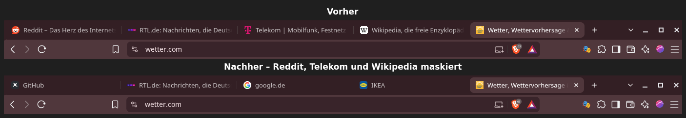
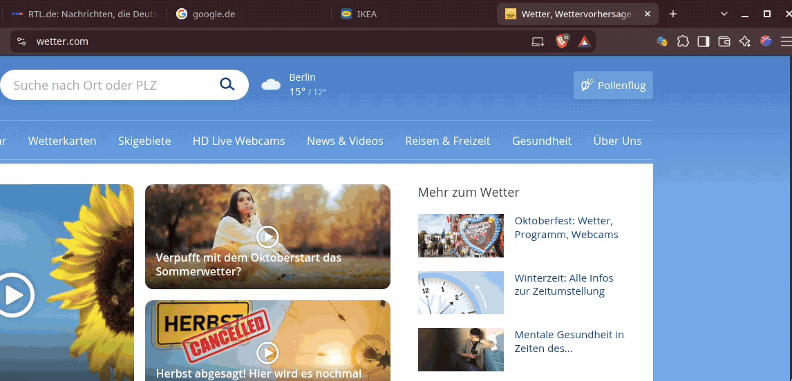

# Tab Masker

Chrome-Erweiterung (Manifest V3), die Domainnamen und Favicons in Browser-Tabs mit
zufälligen, aber pro Domain konsistenten Namen und Icons maskiert – praktisch für
Screensharing, Präsentationen oder öffentliche Bildschirme.

**So sieht es live aus** – Domain im Popup maskieren, neu würfeln, Vorlage wählen:

> **Hinweis:** Tab Masker ändert Titel und Favicon im **Tab**. Die Adressleiste
> zeigt weiterhin die echte URL des aktiven Tabs – beim Bildschirmteilen also
> am besten einen unverfänglichen Tab im Vordergrund haben.

## Funktionen

- **Allowlist-Prinzip**: Standardmäßig wird **keine** Domain maskiert. Nur
  Domains, die du explizit im Popup oder in den Einstellungen hinzufügst,
  bekommen einen Tarnnamen und ein Tarn-Icon.
- **Aktuelle Seite maskieren**: Klick auf das Erweiterungssymbol öffnet das
  Popup mit einem Schalter „Diese Domain maskieren“ – damit landet die aktuell
  geöffnete Domain direkt auf der Maskierungsliste.
- **Automatischer Tarnname**: Beim Hinzufügen bekommt eine Domain einen
  zufälligen, aber deterministischen Tarnnamen einer echten, bekannten Seite
  (z. B. „Outlook“, „Google Docs“, „Steam“, „IKEA“). Als Icon wird das
  **echte Favicon** dieser Seite verwendet, sofern der Browser es im Cache hat
  (also die Seite schon einmal besucht wurde). Sonst zeichnet Tab Masker eine
  vereinfachte Logo-Form in den Markenfarben bzw. ein passendes Emoji. Beim
  erneuten Besuch bleibt die Maskierung gleich.
- **Neu würfeln**: Über das Popup lässt sich pro Domain eine neue zufällige
  Name/Icon-Kombination erzeugen.
- **Vorlagen bekannter Seiten**: Alternativ lässt sich gezielt eine Vorlage
  wählen, die wie eine bekannte Seite aussieht (z. B. „Google“, „google.de“,
  „heise.de“, „Wikipedia“, „Online-Banking“ …).
- **Eigene Namen/Icons**: Name und Emoji lassen sich pro Domain auch frei per
  Texteingabe festlegen.
- **Pausieren/Entfernen**: Domains lassen sich vorübergehend pausieren (Maske
  bleibt gespeichert) oder komplett von der Liste entfernen.
- **Globaler Schalter**: Maskierung lässt sich mit einem Klick komplett
  aktivieren/deaktivieren, ohne die Liste zu verlieren.
- **Verwaltungsseite**: Übersicht aller Domains auf der Maskierungsliste inkl.
  Status, Pausieren/Aktivieren und Entfernen.
- **Update-Benachrichtigung**: Prüft in regelmäßigen Abständen (und beim
  Browserstart), ob es auf GitHub neue Commits gibt. Falls ja, gibt es eine
  Desktop-Benachrichtigung, einen Hinweis im Popup und ein Änderungsprotokoll
  (mit Link zum jeweiligen Commit) auf der Einstellungsseite.

## Installation (Entwicklermodus)

1. `chrome://extensions` (oder `edge://extensions`) öffnen.
2. Oben rechts **Entwicklermodus** aktivieren.
3. **Entpackte Erweiterung laden** klicken.
4. Diesen Projektordner (`Tab_Masker`) auswählen.
5. Fertig – das Icon erscheint in der Symbolleiste.

## Nutzung

- Klick auf das Erweiterungssymbol öffnet das Popup mit Vorschau, Toggle für die
  aktuelle Domain, „Neu würfeln“, „Zurücksetzen“ sowie einem Bereich zum Festlegen
  eines eigenen Namens/Icons.
- „Alle angepassten Domains verwalten“ öffnet die Einstellungsseite mit einer
  Übersicht und der Möglichkeit, Domains gezielt von der Maskierung auszuschließen.
- Änderungen laden den betroffenen Tab automatisch neu, damit Titel und Favicon
  aktualisiert werden.

## Funktionsweise (technisch)

- `common/mask.js`: Deterministische Namens-/Icon-/Farbgenerierung per
  FNV-1a-Hash über den Hostnamen (gleiche Domain → gleiche Maske, bis manuell
  geändert).
- `background.js`: Service Worker, verwaltet Einstellungen in
  `chrome.storage.local` und beantwortet Nachrichten von Content-Script,
  Popup und Optionsseite. Prüft zusätzlich per `chrome.alarms` alle 6 Stunden
  (und beim Browserstart) über die öffentliche GitHub-API, ob es neue Commits
  im Repository gibt, und zeigt bei Bedarf eine Benachrichtigung samt
  Änderungsprotokoll an.
- `content.js`: Läuft **nur auf Domains der Maskierungsliste**, für die du
  den Zugriff freigegeben hast. `background.js` registriert es dafür
  dynamisch per `chrome.scripting.registerContentScripts` (`document_start`),
  setzt
  `document.title` sowie ein per `<canvas>` generiertes Favicon
  (Data-URL) und überwacht per `MutationObserver`, ob die Seite selbst Titel
  oder Favicon ändert, um die Maskierung dauerhaft aufrechtzuerhalten.
- `popup/`, `options/`: UI zur Steuerung.

## Berechtigungen

Tab Masker hat **keinen pauschalen Zugriff auf Webseiten**. Der Zugriff wird
pro Domain erst dann angefragt, wenn du sie zur Maskierungsliste hinzufügst –
der Browser zeigt dabei einen eigenen Bestätigungsdialog. Entfernst du eine
Domain von der Liste, gibt Tab Masker den Zugriff automatisch wieder ab. Alle
aktuell erteilten Freigaben siehst du unter `chrome://extensions` →
Tab Masker → Details → „Websitezugriff“.

| Berechtigung | Wofür |
|---|---|
| `optional_host_permissions` (`*://*/*`) | Nur ein **Rahmen**: Innerhalb dessen fragt Tab Masker einzelne Domains an (z. B. `*://example.com/*`). Ohne deine Zustimmung ist keine Domain freigegeben. |
| `scripting` | Content-Script nur für freigegebene Domains registrieren. |
| `activeTab` | Das Popup erkennt die Domain des aktuellen Tabs, wenn du auf das Symbol klickst – ohne Zugriff auf deine übrigen Tabs oder den Verlauf. |
| `storage` | Maskierungsliste und Einstellungen lokal speichern. |
| `alarms` | Periodischer Update-Check im Hintergrund. |
| `notifications` | Desktop-Benachrichtigung bei neuen Commits. |
| `favicon` | Echte Favicons der Tarnseiten (z. B. amazon.de) aus dem **lokalen** Favicon-Cache des Browsers lesen. Es wird dafür nichts aus dem Internet geladen. |

Zusätzlich setzt das Manifest eine strikte **Content Security Policy**:
Es darf ausschließlich Code aus dem Erweiterungspaket selbst ausgeführt werden
(`script-src 'self'`, kein `eval`, keine nachgeladenen Skripte), und
Netzwerkverbindungen sind nur zu `api.github.com` sowie zur Erweiterung selbst
(für den lokalen Favicon-Cache) erlaubt
(`connect-src 'self' https://api.github.com`).

## Datenschutz

- **Keine Datensammlung, keine Telemetrie, keine Werbung.** Die
  Maskierungsliste und alle Einstellungen liegen ausschließlich lokal in
  `chrome.storage.local`.
- **Einzige Netzwerkverbindung:** der Update-Check, ein lesender Abruf der
  öffentlichen GitHub-API (`api.github.com/repos/tocksick/Tab_Masker/…`) alle
  6 Stunden und beim Browserstart. Dabei werden keine Daten von dir
  übermittelt – weder besuchte Seiten noch die Maskierungsliste. Die CSP
  verhindert technisch Verbindungen zu anderen Servern.
- **Was das Content-Script tut:** Auf freigegebenen Domains ändert es nur
  `document.title` und das Favicon. Es liest keine Seiteninhalte,
  Formulareingaben oder Cookies aus.
- Der komplette Quellcode liegt in diesem Repository; es gibt keinen
  minifizierten oder nachgeladenen Code.

## Upgrade von Version 1.1.x

Bis Version 1.1.x hatte Tab Masker festen Zugriff auf alle Webseiten. Ab 1.2
wird der Zugriff pro Domain angefragt. Nach dem Update öffnet sich einmalig die
Einstellungsseite: Ein Klick auf „Zugriff für alle gelisteten Domains
erteilen“ genügt, damit deine bestehende Liste wieder maskiert wird.

## Icon

Das Erweiterungssymbol ist das 🎭-Emoji aus
[Noto Color Emoji](https://github.com/googlefonts/noto-emoji) (Apache License 2.0).
